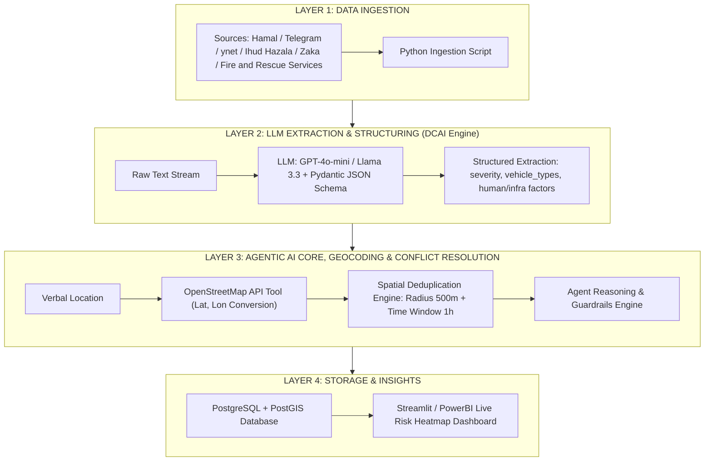

# Project Charter: CHARTER.md

* הערה - תוכן הצארטר נתון לשינויים בהתאם להתקדמות הפרוייקט ונתוני/תוצאות של כל אחד משלבי הפרוייקט.

## Project Name
**From News to Action: A Data-Centric Agentic AI Pipeline for Real-Time Traffic Infrastructure Risk Detection**

---

### 1. בעיה ומשתמש (Problem & Target User)
* **המשתמש:** אנליסט בטיחות בדרכים / דאטה אנליסט/מנכל תקציבים ברשות הלאומית לבטיחות בדרכים (הרלב"ד) או במשרד התחבורה.
* **הכאב המכומת:** האנליסט מאבד **3 עד 6 חודשים** בציפייה לנתוני הלמ"ס והמשטרה הרשמיים המעובדים. איחור זה יוצר "שטחים מתים" (Blindspots) ומעכב זיהוי וטיפול במפגעי תשתית קריטיים (כגון בורות בכביש, תאורה לקויה או הסדרי תנועה מסוכנים), מה שמוביל לעלייה מוערכת של כ-**15% בתאונות חוזרות ונשנות** באותם מוקדים שלא טופלו בזמן.

---

### 2. מדד הצלחה (Success Metrics & Evaluation)
* **זמן תגובה למפגע (Latency):** קיצור זמן זיהוי מפגע תשתיתי וגורם נסיבתי לתאונה מ-**90 ימים** (ממוצע פרסום למ"ס) ל-**פחות מ-24 שעות** מרגע הפרסום הראשוני במדיה.
* **איכות חילוץ הנתונים (Data Precision & Recall):** הישג של לפחות **85% בערכי Precision ו-Recall** בחילוץ ישויות מורכבות ומובנות (Structured NER) מטקסטים חופשיים בעברית על סט בדיקה מאומת (Eval-Set).
* **מדד עיגון ואי-הזיה (Groundedness Score):** שמירה על מדד עיגון של **לפחות 90%** (שימוש בערכת הערכה ייעודית למניעת הזיות מיקום או נסיבות תאונה).

---

### 3. דאטה + תוכנית ב' (Data Sources & Fallback)
* **מקור נתונים ראשוני:** **1,500 דיווחי טקסט בזמן אמת** מערוצי הדוברות הרשמיים בטלגרם (מד"א, איחוד הצלה, כבאות והצלה) ומבזקי חדשות אונליין (ynet, חמ"ל). נבדק ונפתח בפועל באמצעות Python API (`Telethon` / `BeautifulSoup`).
* **תוכנית ב' (במשפט אחד):** אם הניטור החי ייחסם, נעבור באופן מיידי לעבודה מול מאגר היסטורי של 2,000 כתבות תאונות מגרדות (Scraped) מ-ynet ומהלמ"ס מ-12 החודשים האחרונים, המאוחסנות בקובץ CSV/Google Drive משותף.

---

### 4. תרשים ארכיטקטורה (System Architecture Diagram)

להלן ארכיטקטורת המערכת המחולקת ל-4 שכבות עיקריות:

### 5. הכיסא של הסוכן (Agent Specification)
* **מה הסוכן מחליט שקוד רגיל לא יכול?**
  הסוכן מנהל אוטונומית את **פתרון הסתירות המרחביות והשלמת הנתונים (Spatial Conflict Resolution & Contextual Enrichment)**. כשיש דיווחים מקבילים או סותרים על אותה תאונה (למשל: כתבה ב-ynet שמדווחת על "תאונה בכביש 4 ליד גהה" מול דיווח בטלגרם שמציין "תאונה ליד מחלף גבעת שמואל"), קוד דטרמיניסטי רגיל ייכשל או יקים כפילות. הסוכן מפעיל שיקול דעת, מבין את ההקשר הטקסטואלי, מצליב חלונות זמן ורדיוס גאוגרפי, ומכריע מהו הנ"צ המדויק ומהי חומרת האירוע.
* **לאילו כלים יש לו גישה (Agent Tools)?**
  1. `Geocoding_Tool`: פנייה ל-OpenStreetMap / Nominatim API להמרת תיאור מילולי בעברית לקואורדינטות.
  2. `Spatial_Deduplication_Tool`: שאילתת PostgreSQL/PostGIS לאיתור אירועים קיימים ברדיוס 500 מטר ובחלון זמן של שעה.
  3. `Weather_API_Tool`: שליפת תנאי מזג אוויר ותאורה בזמן האירוע לפי המיקום המאומת.
* **מה קורה כשהוא נכשל (Fallback / Guardrails)?**
  אם הסוכן חורג מ-3 נסיונות תיקון עצמי (Max Retries) או מזהה כשל ב-API חיצוני, מנוע ה-**Deterministic Guardrail** שומר את ה-JSON הבסיסי שחולץ ללא הנ"צ, מתייג את הרשומה בבסיס הנתונים כ-`Requires_Manual_Review`, וממשיכה בהרצת ה-Pipeline כרגיל. **המערכת עובדת בצורה מלאה ומניבה פלט גם ללא השכבה האג'נטית.**

---

### 6. סיכונים וגרסת חתך (Risks & Scope Cut)
* **סיכון 1 (הזיות מיקום ב-LLM):** המודל ממציא נ"צ או כתובת לא קיימת.
  * *הערכות:* אכיפת פלט קשיח באמצעות Pydantic Schema ואימות חובה מול API גאוגרפי חיצוני.
* **סיכון 2 (חסימת API / Scraping):** חסימת גישה לטלגרם או שינוי במבנה HTML באתרי החדשות.
  * *הערכות:* מעבר לעבודה מול מאגר סטטי של 2,000 כתבות תאונות מגרדות המאוחסן מראש ב-`data/raw/`.
* **סיכון 3 (חריגת עלויות ואיטיות ב-LLM):** קריאות מרובות מדי למודלים יקרים.
  * *הערכות:* שימוש במודל קטן ומהיר (Llama-3.3-70B via Groq / GPT-4o-mini) והגבלת התיקון העצמי ל-2 סבבים בלבד.
* **משפט חתך (Scope Cut):** *"אם נשארים שבועיים בלבד לפני ההגשה, מוותרים על דאשבורד ה-Streamlit ועל שליפת נתוני מזג האוויר, ומגישים Pipeline עובד שמפיק בסיס נתונים/קובץ CSV מעובד ומאומת ברמת הסוכן בלבד"*.

---

### 7. אבני דרך וכובעים (Milestones & Team Roles)

#### חלוקת תפקידים ותחומי אחריות בפרויקט (Team Roles & Responsibilities)
> **הערה:** חלוקת התפקידים בצוות הינה **דינמית ותשתנה באופן גמיש בהתאם לקצב פיתוח הפרויקט**, עומסי העבודה והצרכים שיווצרו באזורים השונים. 

**תחומי הליבה הדורשים טיפול בפרויקט והובלה משותפת:**
1. **Data Ingestion & Pipeline:** פיתוח סקריפטי האיסוף (Telegram/Scraping) וצינור הנתונים.
2. **Agentic Architecture & Tools:** הגדרת הסוכן (LangGraph), בניית לולאת התיקון העצמי וחיבור הכלים (Geocoding / DB Search).
3. **Guardrails & Fallbacks:** בניית מנגנוני ההגנה וה-Fallback הדטרמיניסטי במקרה של כשל בסוכן.
4. **Prompt Engineering & Structured Schema:** עיצוב הפרומפטים ואכיפת פורמט Pydantic JSON.
5. **Evaluation Set & Benchmarking:** בניית ערכת בדיקה (Eval-Set), מדידת Precision/Recall ומדד Groundedness.
6. **Baseline Engine:** פיתוח מערכת הבסיס (ללא סוכן) לצורך השוואה וטבלת Baseline.
7. **Database & Storage:** הקמה וניהול בסיס הנתונים המרחבי (PostgreSQL + PostGIS).
8. **Product, Documentation & Dashboard:** כתיבת ה-Project Charter, ה-README המרכזי ופיתוח דאשבורד ה-Streamlit.

    